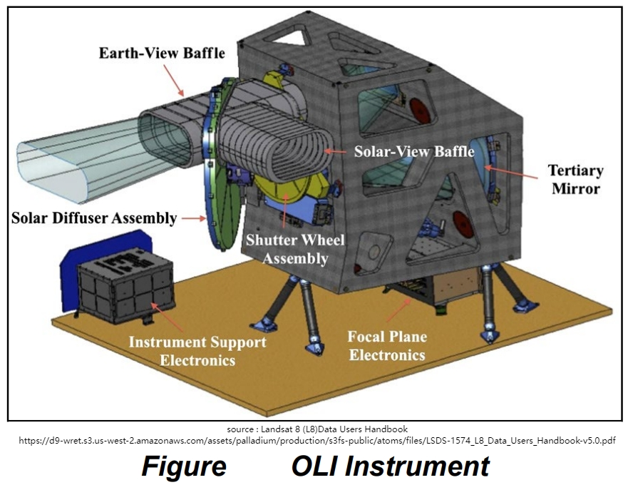
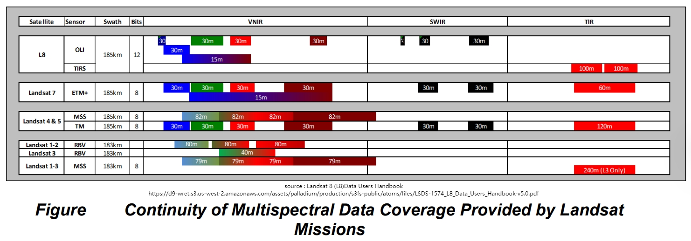

```{r setup, include=FALSE}
options(htmltools.dir.version = FALSE)
```

<!-- ## Introduction: What is Landsat 8's OLI? -->
- **Landsat 8** is part of the Landsat program by **NASA** and **USGS**.
- Equipped with the **Operational Land Imager (OLI)** sensor for Earth observation.
- **Key Features:**
  - Captures data in **nine spectral bands**.
  - Provides **medium-resolution imagery** suitable for various applications.
  - Supports **global land monitoring** efforts.
```{r  echo=FALSE, out.width='50%', fig.align='center'}

```
---

## Technical Overview
- **OLI Sensor Details:**
  - **Spectral Bands:** 9 bands ranging from deep blue to shortwave infrared.
  - **Spatial Resolution:** 30 meters for multispectral bands; 15 meters for panchromatic.
  - **Swath Width:** 185 kilometers.
  - **Revisit Time:** 16 days, enabling regular monitoring.
```{r  echo=FALSE, out.width='97%', fig.align='center'}

```
---

## Application 1: Agricultural Monitoring

### Crop Health and Yield Estimation

- **Case Study:** Mirasi et al. (2021) used multi-temporal Landsat 8 OLI data to estimate wheat grain yields by evaluating sum-NDVI values.

- **Method:** NDVI was derived from OLI imagery and correlated with field-based yield data.

- **Impact:**
  - Provided an efficient method for predicting crop productivity over large areas.
  - Enabled early yield forecasting and decision support for food security policies.

---
## Application 2: Urban Expansion Analysis

### Monitoring City Growth Over Time

- **Case Study:** Deng et al. (2019) employed time-series Landsat 8 OLI imagery to classify urban land cover changes in densely built-up areas.

- **Approach:** Sequential NDVI and spectral indices were used to detect spatial patterns of urban expansion.

- **Impact:**
  - Revealed urban growth hotspots and land conversion trends.
  - Supported evidence-based urban planning and zoning strategy.
  
---

## Challenges & Limitations

- **Cloud Cover:** Optical sensors like OLI are hindered by cloud presence.

- **Moderate Resolution:** May not capture fine-scale features compared to high-resolution sensors.

- **Data Volume:** Large datasets require significant storage and processing capabilities.


## Reflection: Insights & Future Applications

- **Personal Insight:** OLI's consistent data acquisition is invaluable for long-term environmental monitoring.

- **Future Use Cases:**
  - Integration with **machine learning algorithms** for automated land cover classification.
  - Combining OLI data with other sensors for comprehensive environmental assessments.
  - Potential application in **climate change studies** to monitor indicators like deforestation rates.

---

## Conclusion

- **Significance of OLI:** 
Provides reliable, medium-resolution data for diverse Earth observation applications.

- **Final Thought:** 
As technology advances, OLI data will remain a cornerstone in understanding and managing Earth's resources.

---

## References

- U.S. Geological Survey. (2015). *Landsat 8 Data Users Handbook*. Retrieved from https://www.usgs.gov/landsat-missions/landsat-8-data-users-handbook  
- Mirasi, A., Mahmoudi, A., & Navid, H. (2021). Evaluation of sum-NDVI values to estimate wheat grain yields using multi-temporal Landsat OLI data. *Geocarto International*. https://doi.org/10.1080/10106049.2021.1877771  
- Deng, Z., Zhu, Q., He, L., & Tang, L. (2019). Land use/land cover classification using time series Landsat 8 images in a heavily urbanized area. *Advances in Space Research*, 64(9), 1877–1887. https://doi.org/10.1016/j.asr.2019.06.021